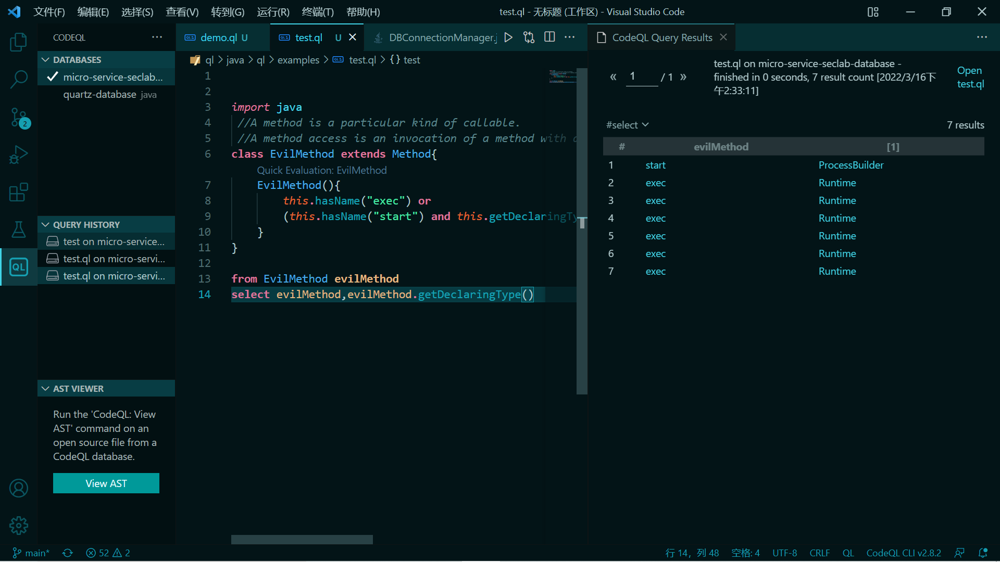

# CodeQL-Query-学习

## 前言

感觉想写出比较好的查询还是需要对CodeQL和AST有非常深刻的了解，所以还是得好好学习学习。记录下语法学习以及各种查询的编写。


## 学习自fynch3r师傅文章的笔记

AST上面的节点是语句/表达式 Expr Stmt

数据流图上的节点是传递value的语义元素 ExprNode ParameterNode

> Some AST nodes (such as expressions) have corresponding data flow nodes, but others (such as `if` statements) do not. This is because expressions are evaluated to a value at runtime, whereas `if` statements are purely a control-flow construct and do not carry values. There are also data flow nodes that do not correspond to AST nodes at all.

AST上面的节点：Stmt，Expr

Expr有对应的数据流图节点，因为表达式在数据流分析过程中变成了value

Stmt没有对应的数据流图节点，比如if，纯纯的控制流结构，不携带任何值

当然，数据流图还有很多节点中根本没在抽象语法树中出现；


想要查询路径的需要带上`@kind path-problem`。这东西似乎叫元数据。

数据流分析常规模板：

```java
class MyConfig extends TaintTracking::Configuration {
  MyConfig() { this = "MyConfig" }

  override predicate isSource(DataFlow::Node node) { node instanceof MySource }

  override predicate isSink(DataFlow::Node node) { node instanceof MySink }
}

from MyConfig config, DataFlow::PathNode source, DataFlow::PathNode sink
where config.hasFlowPath(source, sink)
select sink.getNode(), source, sink, "Sink is reached from $@.", source.getNode(), "here"
```


专有名词：

- statement 语句
- predicate 谓词
- clause 子句


自定义类：

```java
import java
 //A method is a particular kind of callable.
 //A method access is an invocation of a method with a list of arguments.
class EvilMethod extends Method{
    EvilMethod(){
        this.hasName("exec") or
        (this.hasName("start") and this.getDeclaringType().hasQualifiedName("java.lang", "ProcessBuilder"))
    }
}

from EvilMethod evilMethod
select evilMethod,evilMethod.getDeclaringType()
```




QL特点：

- Declarative 命令式 ：描述了结果必须满足的属性，而不是提供计算结果的过程。
- Object-oriented 面向对象


**谓词：**

`predicate`，理解成QL中的函数，有两种：有返回值和没返回值的，这里给简单的例子：

```java

import java

predicate isFeng(string name){
    name = "feng"
}
string getFeng(string name){
    name = "feng" and
    result = "hello,feng"
}

from string s
where isFeng(s)
select getFeng(s)
```

有返回值的就不写`predicate`，写的是返回值类型了。


还有递归谓词，不过这个例子非常非常非常的抽象。。。

```java

import java

string getANeighbor(string country) {
    country = "France" and result = "Belgium"
    or
    country = "France" and result = "Germany"
    or
    country = "Germany" and result = "Austria"
    or
    country = "Germany" and result = "Belgium"
    or
    country = getANeighbor(result)
  }
  
  
  from string s
  where s = "Belgium"
  select getANeighbor(s)
```

可以得到`France`和`Germany`。。。


规范：

- 谓词可以在任意地方定义，可以有返回值也可以没有，返回值默认变量为`result`。
- 谓词名称为小写字母开头，驼峰命名就是一个不错的选择。
- 参数列表逗号分割，每个参数类型+形参名称。
- 谓词体，逻辑公式。


谓词的种类：

- 非成员谓词Non-member predicate ： class外定义的谓词，不属于任何class
- 成员谓词：class内定义的常规谓词
- 特征谓词：简单粗暴，**构造函数**级别的谓词，直接规定


**行为绑定**：

感觉又很抽象。。。因为不能无限，就是这样：

```
from int i
select i
```

但我不明白为什么这样一定要加`bindingset[i]`：

```java
bindingset[i]
int multiplyBy4(int i) {
    result = i * 4
}

from int i
where i in [1..10]
select multiplyBy4(i)
```

抽象。。。


**类型Type**：

QL是一门静态类型语言，所以每一个变量都是拥有自己的声明类型的。

Type有五种：数据库类型、class类型、字符类型、类域（class domain）类型


原始属性：

- boolean：true or false
- float：64位浮点数
- int：32位整数
- string：字符串
- date：日期


类：

1. QL中自定义的类一定要至少extends一个父类，被extends的父类被称为base types
2. QL中的类允许多继承
3. 不得extends final类


范围:[3..7]，表示3，4，5，6，7


**聚合**：

聚合是一种映射，它根据公式指定的一组输入值计算结果值。

```java
<aggregate>(<variable declarations> | <formula> | <expression>)
```

具体参考文章。


**Cast类型强转**：

强制类型转换有2种形式：

- postfix 后缀，`x.(Foo)` 表示将x限制为Foo类型
- prefix 前缀，`(Foo)x` 也表示将x限制为Foo类型


**公式 Formula**

```java
<expression> instanceof <type>
<expression> in <type>
<expression> = <type>
exists(<variable declarations> | <formula1> and <formula2>)

```


**递归**

1次或多次：

```java
Person getAnAncestor() {
  result = this.getAParent()
  or
  result = this.getAParent().getAnAncestor()
}

等价于getparent+() 返回p的所有祖先（不包含p）

```

0次或多次：

```java
Person getAnAncestor2() {
  result = this
  or
  result = this.getAParent().getAnAncestor2()
}

等价于getAParent*() 返回p的所有祖先（包含p）
```


## 各种编写

判断函数返回值为void

```java
class FastJsonSetMethod extends Method{
  FastJsonSetMethod(){
    exists(VoidType vt|
      vt = this.getReturnType()
      )
  }
}
```

函数参数数量(this为method)

```java
this.getNumberOfParameters() = 0
```


获取函数所属的类：

```java
getDeclaringType()
```


