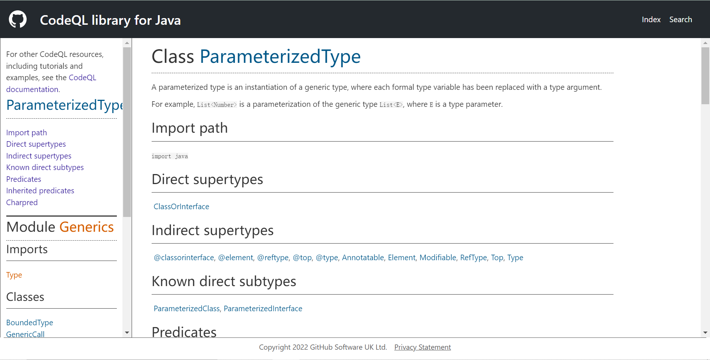
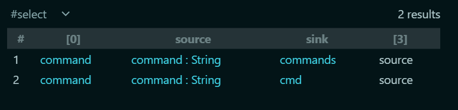

# CodeQL入门

## 前言

开始CodeQL的入门学习，学习文章见参考链接。

## 安装及配置

参考链接中的文章即可。

记录一下创建数据库：

```shell
codeql database create D:\environment\CodeQL\databases\micro-service-seclab-database  --language="java"  --command="mvn clean install --file pom.xml" --source-root=D:\this_is_feng\codeql_about\micro_service_seclab
```

## 基本语法

即编写ql查询语句。

引入CodeQL类库：

```ql
import java
```

获取int：

```sql
from int i
where i = 1
select i
```

QL查询的语法结构：

```sql
from [datatype] var
where condition(var = something)
select var
```


常用ql类库

|     名称     |                             解释                             |
| :----------: | :----------------------------------------------------------: |
|    Method    |      方法类，Method method表示获取当前项目中所有的方法       |
| MethodAccess | 方法调用类，MethodAccess call表示获取当前项目当中的所有方法调用 |
|  Parameter   |       参数类，Parameter表示获取当前项目当中所有的参数        |


**谓词**：把很长的查询语句封装成函数

```java
predicate isStudent(Method method) {
exists(|method.hasName("getStudent"))
}
```

> predicate 表示当前方法没有返回值。
>
> exists子查询，是CodeQL谓词语法里非常常见的语法结构，它根据内部的子查询返回true or false，来决定筛选出哪些数据。


> 在代码自动化安全审计的理论当中，有一个最核心的三元组概念，就是(source，sink和sanitizer)。
>
> source是指漏洞污染链条的输入点。比如获取http请求的参数部分，就是非常明显的Source。
>
> sink是指漏洞污染链条的执行点，比如SQL注入漏洞，最终执行SQL语句的函数就是sink(这个函数可能叫query或者exeSql，或者其它)。
>
> sanitizer又叫净化函数，是指在整个的漏洞链条当中，如果存在一个方法阻断了整个传递链，那么这个方法就叫sanitizer。

所以其实自动化审计是找一条从source到sink且不存在sanitizer的链。

通过`config.hasFlowPath(source, sink)`来判断是否连通，也就是存在漏洞。

设置source和sink：

```sql
class VulConfig extends TaintTracking::Configuration {
    VulConfig() { this = "SqlInjectionConfig" }
  
    override predicate isSource(DataFlow::Node src) { src instanceof RemoteFlowSource }
  
    override predicate isSink(DataFlow::Node sink) {
      exists(Method method, MethodAccess call |
        method.hasName("query")
        and
        call.getMethod() = method and
        sink.asExpr() = call.getArgument(0)
      )
    }
  }
```

需要`import`：

```java
import semmle.code.java.dataflow.FlowSources
import semmle.code.java.security.QueryInjection
import DataFlow::PathGraph
```


## 解决误报

```sql
import java
import semmle.code.java.dataflow.FlowSources
import semmle.code.java.security.QueryInjection
import DataFlow::PathGraph


class VulConfig extends TaintTracking::Configuration {
    VulConfig() { this = "SqlInjectionConfig" }
  
    override predicate isSource(DataFlow::Node src) { src instanceof RemoteFlowSource }
  
    override predicate isSink(DataFlow::Node sink) {
      exists(Method method, MethodAccess call |
        method.hasName("query")
        and
        call.getMethod() = method and
        sink.asExpr() = call.getArgument(0)
      )
    }

  }

  from VulConfig config, DataFlow::PathNode source, DataFlow::PathNode sink
  where config.hasFlowPath(source, sink)
  select source.getNode(), source, sink, "source"
```

会发现有报的这里不能SQL注入：

```java
    // 这并不是一个注入，如果SAST扫描器将这个报为SQL注入漏洞，那么这是一个误报问题
    @PostMapping(value = "/longin")
    public List<Student> longin(@RequestBody List<Long> user_list) {
        return indexLogic.getStudentWithInLong(user_list);
    }
```

因为`Long`肯定不能SQL注入，但是它似乎是因为在List里面导致了codeql无法认为它是不能SQL注入了，这时候需要借助另外一个方法`isSanitizer`：

> isSanitizer是CodeQL的类`TaintTracking::Configuration`提供的净化方法。它的函数原型是：
>
> override predicate isSanitizer(DataFlow::Node node) {}
>
> 在CodeQL自带的默认规则里，对当前节点是否为基础类型做了判断。
>
> override predicate isSanitizer(DataFlow::Node node) {
> node.getType() instanceof PrimitiveType or
> node.getType() instanceof BoxedType or
> node.getType() instanceof NumberType
> }
>
> 表示如果当前节点是上面提到的基础类型，那么此污染链将被净化阻断，漏洞将不存在。

所以增加类似`List<Long`的判断即可：

```
    override predicate isSanitizer(DataFlow::Node node) {
        node.getType() instanceof PrimitiveType or
        node.getType() instanceof BoxedType or
        node.getType() instanceof NumberType or
        exists(ParameterizedType pt| node.getType() = pt and pt.getTypeArgument(0) instanceof NumberType )
      }
  }
```



## 解决漏报

文章的这种情况我并没有遇到，可能是codeql更新了。

解决办法则是`isAdditionalTaintStep`方法：

> isAdditionalTaintStep方法是CodeQL的类`TaintTracking::Configuration`提供的的方法，它的原型是：
>
> override predicate isAdditionalTaintStep(DataFlow::Node node1, DataFlow::Node node2) {}
>
> 它的作用是将一个可控节点
> A强制传递给另外一个节点B，那么节点B也就成了可控节点。

## Lombok问题

因为Lombok用注解生成getter、setter之类的，但是codeql中没法获取这些。

解决办法是github上的：https://github.com/github/codeql/issues/4984

```
# get a copy of lombok.jar
wget https://projectlombok.org/downloads/lombok.jar -O "lombok.jar"
# run "delombok" on the source files and write the generated files to a folder named "delombok"
java -jar "lombok.jar" delombok -n --onlyChanged . -d "delombok"
# remove "generated by" comments
find "delombok" -name '*.java' -exec sed '/Generated by delombok/d' -i '{}' ';'
# remove any left-over import statements
find "delombok" -name '*.java' -exec sed '/import lombok/d' -i '{}' ';'
# copy delombok'd files over the original ones
cp -r "delombok/." "./"
# remove the "delombok" folder
rm -rf "delombok"
```

下载lombok.jar，然后把它放到Java代码下面然后`java -jar "lombok.jar" delombok -n --onlyChanged . -d "delombok"`这样`delombok`目录里面就会出现之前用了lombok的那些类且存在了getter、setter之类的，就实现了那些代码的还原，接下来就是扔回去然后创建数据库就行了（因为我不知道数据库如何更新）

最终代码：

```sql
import java
import semmle.code.java.dataflow.FlowSources
import semmle.code.java.security.QueryInjection
import DataFlow::PathGraph


class VulConfig extends TaintTracking::Configuration {
    VulConfig() { this = "SqlInjectionConfig" }
  
    override predicate isSource(DataFlow::Node src) { src instanceof RemoteFlowSource }
  
    override predicate isSink(DataFlow::Node sink) {
      exists(Method method, MethodAccess call |
        method.hasName("query")
        and
        call.getMethod() = method and
        sink.asExpr() = call.getArgument(0)
      )
    }

    override predicate isSanitizer(DataFlow::Node node) {
        node.getType() instanceof PrimitiveType or
        node.getType() instanceof BoxedType or
        node.getType() instanceof NumberType or
        exists(ParameterizedType pt| node.getType() = pt and pt.getTypeArgument(0) instanceof NumberType )
      }
  }

  from VulConfig config, DataFlow::PathNode source, DataFlow::PathNode sink
  where config.hasFlowPath(source, sink)
  select source.getNode(), source, sink, "source"
```


## rce的检测

跟着文章学习了SQL注入的检测之后，大致有了自己的想法。

总的来说，想实现一些基本的简单还是不太难的，主要的障碍还是对于QL语法的不熟悉，不知道都有哪些类，有什么方法，能获得什么东西。

但是想要实现比较深入和细致的检测也还是需要深入学很多的，慢慢来了。

靶场的rce比较简单，一个就是`Runtime`的exec，另外一个就是`ProcessBuilder`。

`exec`直接`Method`检测，`ProcessBuilder`因为命令是写在构造器上的，所以是对构造器进行检测，但是也是因为对QL的不熟悉不太会，学习了。

最后代码如下：

```sql
import java
import semmle.code.java.dataflow.FlowSources
import semmle.code.java.security.QueryInjection
import DataFlow::PathGraph


class VulConfig extends TaintTracking::Configuration {
    VulConfig() { this = "RceInjectionConfig" }
  
    override predicate isSource(DataFlow::Node src) {
       src instanceof RemoteFlowSource 
    }
  
    override predicate isSink(DataFlow::Node sink) {
      exists(Method method, MethodAccess call ,ConstructorCall expr ,Constructor cons|
        (
          method.hasName("exec")
          and
          call.getMethod() = method 
          and
          sink.asExpr() = call.getArgument(0)
        )
        or
        (
          cons.getDeclaringType().hasName("ProcessBuilder")
          and
          expr.getConstructor() = cons
          and
          method.hasName("start")
          and
          sink.asExpr() = expr.getArgument(0)
        )
      )
    }

    override predicate isSanitizer(DataFlow::Node node) {
        node.getType() instanceof PrimitiveType or
        node.getType() instanceof BoxedType or
        node.getType() instanceof NumberType or
        exists(ParameterizedType pt| node.getType() = pt and pt.getTypeArgument(0) instanceof NumberType )
      }
}

  from VulConfig config, DataFlow::PathNode source, DataFlow::PathNode sink
  where config.hasFlowPath(source, sink)
  select source.getNode(), source, sink, "source"
```



## 参考链接

https://www.freebuf.com/articles/web/283795.html