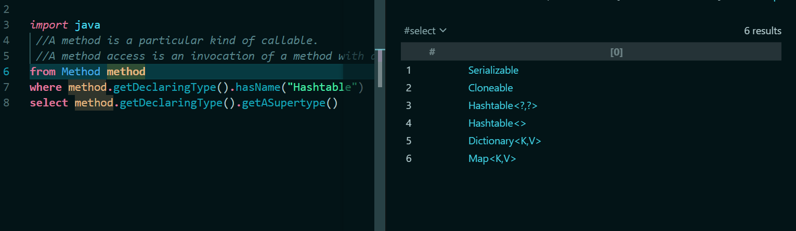
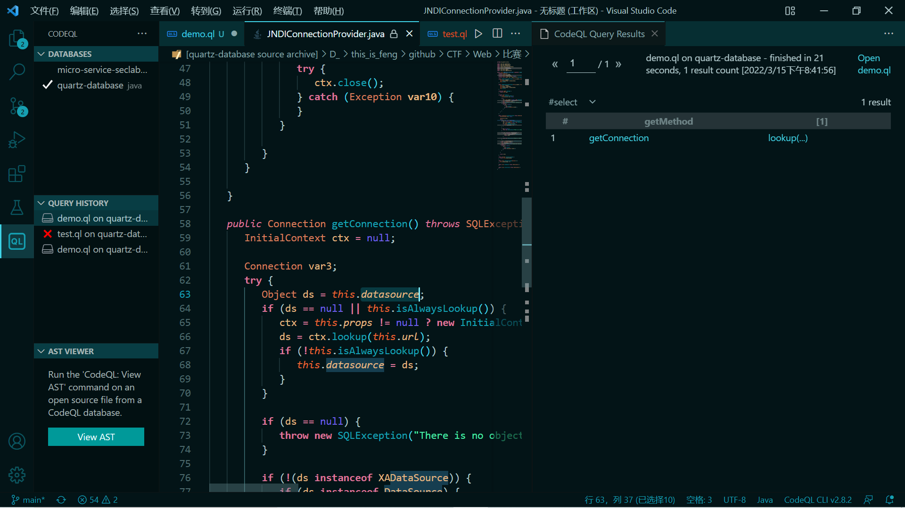

# 利用CodeQL挖掘fastjson利用链

## 前言

其实说白了就是query写的好不好和AST熟不熟。。。学习自先知上的文章

## QL编写思路

找的是jndi链子。入口肯定是getter和setter，根据2者的规则写出QL。

getter的规则：

1. 以get开头
2. 没有函数参数
3. 是我们的code database中的函数
4. 为public方法
5. 函数名长度要大于3

setter的规则：

1. 以set开头
2. 函数参数为一个
3. 是我们code database中的函数
4. 为public方法
5. 函数名长度大于3
6. 返回值为void


```java
//setter
class FastJsonSetMethod extends Method{
  FastJsonSetMethod(){
    this.getName().indexOf("set") = 0 and
    this.getName().length()>3 and
    this.isPublic() and
    this.fromSource() and
    exists(VoidType vt|
      vt = this.getReturnType()
      ) and
      this.getNumberOfParameters() = 1
  }
}
//getter
class FastJsonGetMethod extends Method{
  FastJsonGetMethod(){
    this.getName().indexOf("get") = 0 and
    this.getName().length()>3 and
    this.isPublic() and
    this.fromSource() and
    this.getNumberOfParameters() = 0
  }
}
```

最后就是jndi点了，JNDI函数规则：

1. 这个函数名为lookup
2. 这个函数所在的类实现了"javax.naming.Context"接口

代码：

```java
class JNDIMethod extends Method{
  JNDIMethod(){
    this.getDeclaringType().getASupertype*().hasQualifiedName("javax.naming", "Context") and
    this.hasName("lookup")
  }
}
```

这里用到了递归的写法`getASupertype*()`，`getASupertype()`的作用是`Gets a direct supertype of this type.`

这里我对`Hashtable`做了测试：

```java
public class Hashtable<K,V>
    extends Dictionary<K,V>
    implements Map<K,V>, Cloneable, java.io.Serializable {
```

结果如下

所以其实就是获取直接的继承和实现类了。

而这种递归的写法：`*`(从本身开始调用)或者`+`(从上一级开始调用)，这样可以直接向上面递归搜索。


最后是`sink`的判断：

```java
MethodAccess seekSink(Method sourceMethod){
    exists(
        MethodAccess ma, Method method|
        (ma.getEnclosingStmt() = sourceMethod.getBody().getAChild*() and
        method = ma.getMethod()) or
        (ma.getEnclosingStmt() = sourceMethod.getBody().getAChild*() and ma.getArgument(0).(ClassInstanceExpr).getAnonymousClass().isAnonymous() and method = ma.getArgument(0).(ClassInstanceExpr).getAnonymousClass().getAMethod())|
        if method instanceof JNDIMethod
        then result = ma
        else result = seekSink(method)
    )
}
```

一点一点分析吧，`ma.getEnclosingStmt() = sourceMethod.getBody().getAChild*()`，`getEnclosingStmt()`获取最靠近的那个statement，可以大约的认为就是调用的那行代码。`getBody`是获取那个方法的代码，然后`getAChild*()`递归调用这个body中所有的stmt。通过这个来得到getter中所有的方法调用`ma`，然后` method = ma.getMethod())`获取此方法调用的方法，然后最后：

```java
        if method instanceof JNDIMethod
        then result = ma
        else result = seekSink(method)
```

如果它是JNDI方法就result，否则的话就递归跟进这个方法。


中间的or：

```java
        (ma.getEnclosingStmt() = sourceMethod.getBody().getAChild*() and ma.getArgument(0).(ClassInstanceExpr).getAnonymousClass().isAnonymous() and method = ma.getArgument(0).(ClassInstanceExpr).getAnonymousClass().getAMethod())
```

检测传入参数的第一个是不是匿名类，如果是就获取这个匿名类的方法。

代码：

```java

import java
import semmle.code.java.dataflow.FlowSources
import semmle.code.java.security.QueryInjection
import DataFlow::PathGraph

//setter
class FastJsonSetMethod extends Method{
  FastJsonSetMethod(){
    this.getName().indexOf("set") = 0 and
    this.getName().length()>3 and
    this.isPublic() and
    this.fromSource() and
    exists(VoidType vt|
      vt = this.getReturnType()
      ) and
      this.getNumberOfParameters() = 1
  }
}
//getter
class FastJsonGetMethod extends Method{
  FastJsonGetMethod(){
    this.getName().indexOf("get") = 0 and
    this.getName().length()>3 and
    this.isPublic() and
    this.fromSource() and
    this.getNumberOfParameters() = 0
  }
}

class JNDIMethod extends Method{
  JNDIMethod(){
    this.getDeclaringType().getASupertype*().hasQualifiedName("javax.naming", "Context") and
    this.hasName("lookup")
  }
}

MethodAccess seekSink(Method sourceMethod){
  exists(
      MethodAccess ma, Method method|
      (ma.getEnclosingStmt() = sourceMethod.getBody().getAChild*() and
      method = ma.getMethod()) or
      (ma.getEnclosingStmt() = sourceMethod.getBody().getAChild*() and ma.getArgument(0).(ClassInstanceExpr).getAnonymousClass().isAnonymous() and method = ma.getArgument(0).(ClassInstanceExpr).getAnonymousClass().getAMethod())|
      if method instanceof JNDIMethod
      then result = ma
      else result = seekSink(method)
  )
}


class VulConfig extends TaintTracking::Configuration {
    VulConfig() { this = "RceInjectionConfig" }
  
    override predicate isSource(DataFlow::Node src) {
       src instanceof RemoteFlowSource 
    }
  
    override predicate isSink(DataFlow::Node sink) {
      exists(Method method, MethodAccess call ,ConstructorCall expr ,Constructor cons|
        (
          method.hasName("exec")
          and
          call.getMethod() = method 
          and
          sink.asExpr() = call.getArgument(0)
        )
        or
        (
          cons.getDeclaringType().hasQualifiedName("java.lang", "ProcessBuilder")
          and
          expr.getConstructor() = cons
          and
          method.hasName("start")
          and
          sink.asExpr() = expr.getArgument(0)
        )
      )
    }

    override predicate isSanitizer(DataFlow::Node node) {
        node.getType() instanceof PrimitiveType or
        node.getType() instanceof BoxedType or
        node.getType() instanceof NumberType or
        exists(ParameterizedType pt| node.getType() = pt and pt.getTypeArgument(0) instanceof NumberType )
      }
}
from FastJsonGetMethod getMethod
select getMethod, seekSink(getMethod)
 // from VulConfig config, DataFlow::PathNode source, DataFlow::PathNode sink
 // where config.hasFlowPath(source, sink)
//  select source.getNode(), source, sink, "source"
```


## SUSCTF2022实战

因为SUSCTF2022的第一个Java要挖fastjson的链子，所以学习过之后就拿这个来实战了一下。

但是要nm踩一堆坑啊我真的吐了。

（**下面是没有成功的，直接往最下面看**）

首先问题就是，当时环境给的lib全是jar包，而codeql建库是需要编译的（严格来说是需要编译时的一些信息）

> 在使用CodeQL生成Java项目的数据库时，如果没有指定’–command’，CodeQL会根据平台的不同，调用./java/tools/autobuild.cmd或 ./java/tools/autobuild.sh对项目进行分析。如果该项目的编译工具为Gradle、Maven或Ant，且能找到相应的配置文件。程序就会进入相应的流程，调用相关的编译指令对项目进行编译。CodeQL会收集项目编译过程中产生的信息，并以此生成数据库。

jar包全是class，所以要先解压缩然后反编译。反编译要利用IDEA中的一个插件的jar包，这个自行百度，我的是在`D:\applications\IntelliJ IDEA 2020.2.3\plugins\java-decompiler\lib\java-decompiler.jar`，然后利用这个jar包把题目中的`quartz.jar`进行反编译（因为打算挖的jar包是这个）：

```
D:\environment\jdk-13.0.2\bin\java.exe -cp "D:\applications\IntelliJ IDEA 2020.2.3\plugins\java-decompiler\lib\java-decompiler.jar" org.jetbrains.java.decompiler.main.decompiler.ConsoleDecompiler -dgs=true quartz.jar decompiler_test
```

而且这个jar包需要高版本的JDK才能运行。

反编译之后，就要想办法建库了，而建库就得编译（wcnmd）

这里踩了一堆坑，最后我的解决办法是这样的（或许不是正解，但是确实可以）：

比如我这里解压缩得到的目录是`D:\this_is_feng\github\CTF\Web\比赛\2022-SUSCTF\baby gadget v1.0\lib\decompiler_test-test`，下面是`META-INF`和`org`目录，这时候在这个当前目录中建立pom.xml，把`D:\this_is_feng\github\CTF\Web\比赛\2022-SUSCTF\baby gadget v1.0\lib\decompiler_test-test\META-INF\maven\org.quartz-scheduler\quartz`下面的pom.xml复制过来。

然后还是这个目录，依次建立`./src/main/java/`目录，然后在`java`目录下面把那个org目录复制过来。

然后建库：

```
codeql database create D:\environment\CodeQL\databases\quartz-database  --language="java"   --source-root="D:\this_is_feng\github\CTF\Web\比赛\2022-SUSCTF\baby gadget v1.0\lib\decompiler_test-test" --command="mvn compile -fn"
```

执行的command是`mvn compile -fn`，虽然编译会报错，`-fn`参数不用管它。因为mvn装pom.xml中的依赖还会报一些错误，我遇到的是因为我电脑中没有`svn`，装一下之后再弄，虽然还是报错但是最后库能建好。

然后利用上面的来挖一下链子，成功挖到一个链子：




**很重要的一点，我后来发现实际上这样编译的话会因为不能完全编译成功导致库中只有能编译过的代码，所以实际上有一部分代码库中没有信息导致了不能被check，而且也确实题目的预期解的链子就是没编译通过的那部分导致那个链子没有找到，还是我太菜了呜呜不知道怎么编译**


后来从github官网上弄到源码然后编译，然后tm官网的我都编译不了，我cnmbd，再见，在下告辞。